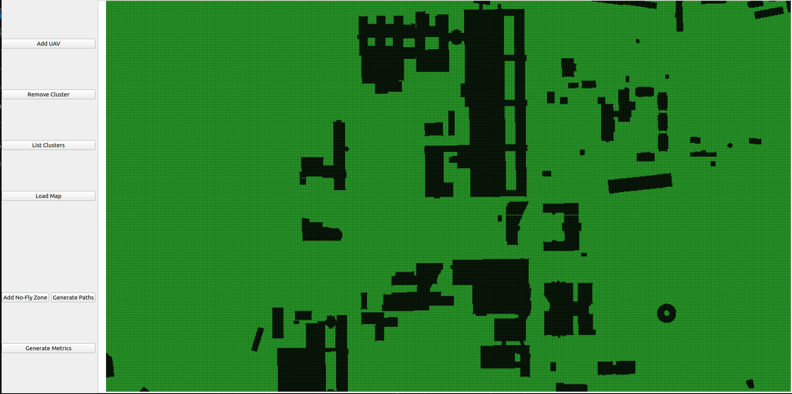

# C-DyMAB: Anytime Cluster-Based Multi-Agent Path Planning Using Non-Stationary Multi-Armed Bandit and Adaptive Large Neighborhood Search

C-DyMAB (Cluster-Based Dynamic Multi-Armed Bandit for Neighborhood Selection), a novel anytime algorithm for MAPF problems. C-DyMAB integrates dynamic high-level clustering based on agent positions with low-level
path optimization using Non-Stationary MAB and ALNS.

We have implemented 2 versions of DyMAB tailored for Non-sationnary MAB : DyMAB($\alpha$-UCB) and DyMAB($\epsilon$-Greedy)

Note: The code is based on Balance-MAPF implementation(https://github.com/thomyphan/anytime-mapf).


The code require `Python 3.10` and external C++ libraries [`BOOST 1.81.0`](https://www.boost.org/) and [`Eigen 3.3`](https://eigen.tuxfamily.org/), and [`CMake`](https://cmake.org)

## Installation procedure

1. Clone the reposotory  to for example:  ```~/git```
```
mkdir -p ${HOME}/git
cd ${HOME}/git && git clone <repository's link>
```
2. Move to project directory and install requirements.txt
```
cd ${HOME}/dymab && pip install -r requirements.txt
```
3. Then Move to  models/cluster-MAPF/dymab-mapf
```
cmake -DCMAKE_BUILD_TYPE=RELEASE .
make
```

## Run the code without clustering(DyMAB)
To run the code, we will use  MAPF instances from the MAPF benchmark (https://movingai.com/benchmarks/mapf/index.html). In particular, the format of the scen files is explained here: https://movingai.com/benchmarks/formats.html.

```
./dymab -m Berlin_1_256.map -a Berlin_1_256-random-1.scen -o test -k 500 -t 120 --outputPaths=paths.txt --banditAlgo=AlphaUCB --neighborCandidateSizes=5 --seed=0 --alphaUCB=10000 --decayWindow=100 --lambdaDecay=10 --initialEpsilon=0.5
```
| Tab                        | Description                                                                    |
| :---                       | :---:                                                                          |
| m                          | the map file from the MAPF benchmark                                           |
| a                          | the scenario file                                                              |
| o                          | the output file name                                                           |
| k                          | the number of agents                                                           |
| outputPaths                | the output file that contains the paths                                        |
| banditAlgo                 | the MAB algorithm used(AlphaUCB, EpsilonGreedy)                                |
| neighborCandidateSizes     | the number of neighborhood size(fixed to 5)                                    |
| seed                       | the random seed                                                                |
| alphaUCB                   | exploration parameter for DyMAB($\alpha$-UCB) policy                           |
| decayWindow                | Capacity of the sliding window                                                 |
| lambdaDecay                | Decay rate                                                                     |
| initialEpsilon             | Initial exploration rate for the DyMAB($\epsilon$-Greedy) policy               |


## Run the code with clustering(C-DyMAB)

1. Move the main directory of the project 
```
cd simulation
python run_script.py or 
python main.py with graphical interface
```



The statistics(cvs file) is located in ```/simulation/image/```

## Demo in our NewCity Map


## Credits

The software is mainly based on code developed by T. Phan and al. in [Balance](https://github.com/thomyphan/anytime-mapf).

The rule-based MAPF solvers (i.e., PPS, PIBT, and winPIBT) inside the software were borrowed from 
https://github.com/Kei18/pibt/tree/v1.3

C-DyMAB is released under MiT License. See license.txt for further details.

## References

- [1] T. Phan et al. *"Adaptive Anytime Multi-Agent Path Finding using Bandit-Based Large Neighborhood Search"*. AAAI 2024.
- [2] J. Li et al. *"MAPF-LNS2: Fast Repairing for Multi-Agent Path Finding via Large Neighborhood Search"*. AAAI 2022.
- [3] J. Li et al. *"MAPF-LNS: Anytime Multi-Agent Path Finding via Large Neighborhood Search"*.  IJCAI 2021.
- [4] A. Gravier et al. *"On Upper-Confidence Bound Policies for Non-Stationary Bandit Problems"*.  HAL 2008.


